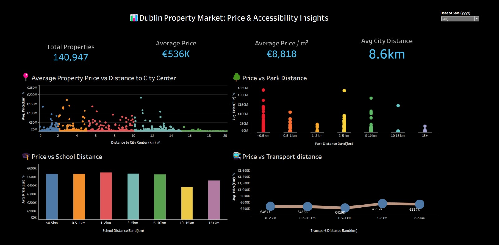

# Dublin Property Price Analysis (2017–2025)

## Live Dashboard

🔗 Tableau Public Dashboard:

https://public.tableau.com/app/profile/kalyani.kavuri/viz/Property_Prices_dashboard/Dashboard1

## Dashboard Preview

## Project Overview

This MSc Dissertation project analyzes Dublin residential property prices between 2017 and 2025 using property transaction data, geospatial datasets, and accessibility indicators.

The project explores how factors such as proximity to parks, schools, colleges, universities, public transport, and Dublin City Centre influence residential property values across Dublin.

## Research Objectives

- Analyze Dublin property price trends from 2017–2025.
- Measure accessibility to key public amenities.
- Evaluate the impact of parks and green spaces on property prices.
- Assess transportation accessibility and property values.
- Perform geospatial analysis using location-based datasets.
- Build interactive Business Intelligence dashboards for decision support.

## Dashboard Features

- Property Price Distribution Analysis
- Average Property Price Trends
- Price vs Distance to City Centre
- Price vs Distance to Parks
- Price vs Distance to Schools
- Price vs Distance to Public Transport
- Geographic Property Insights
- Accessibility Analysis
- Interactive Filters and KPIs

## Tools & Technologies

- Python
- Tableau
- Pandas
- NumPy
- Geospatial Analytics
- OpenStreetMap (OSM)
- Excel
- Business Intelligence
- Data Visualization

## Skills Demonstrated

- Data Cleaning & Preparation
- Data Analysis
- Geospatial Analytics
- Dashboard Development
- Data Visualization
- Business Intelligence Reporting
- Statistical Analysis
- Research Methodology
- Dissertation Writing

## Repository Contents

- Report.docx
- Presentation.pptx
- dublin_property_dashboard.py
- dublin_property_dashboard_preview.jpeg

## Data Sources

- Irish Property Price Register (PPR)
- OpenStreetMap (OSM)
- Dublin Parks & Open Spaces Data
- Schools, Colleges & Universities Data
- Public Transportation Data

## Key Findings

- Property prices generally decrease as distance from Dublin City Centre increases.
- Accessibility to parks and public amenities contributes positively to property values.
- Transportation connectivity plays a significant role in residential property pricing.
- Certain Dublin regions consistently outperform others in property value growth.

## Author

**Kalyani Kavuri**

MSc Data Analytics  
Dublin Business School

GitHub: https://github.com/kalyanikavuri26
